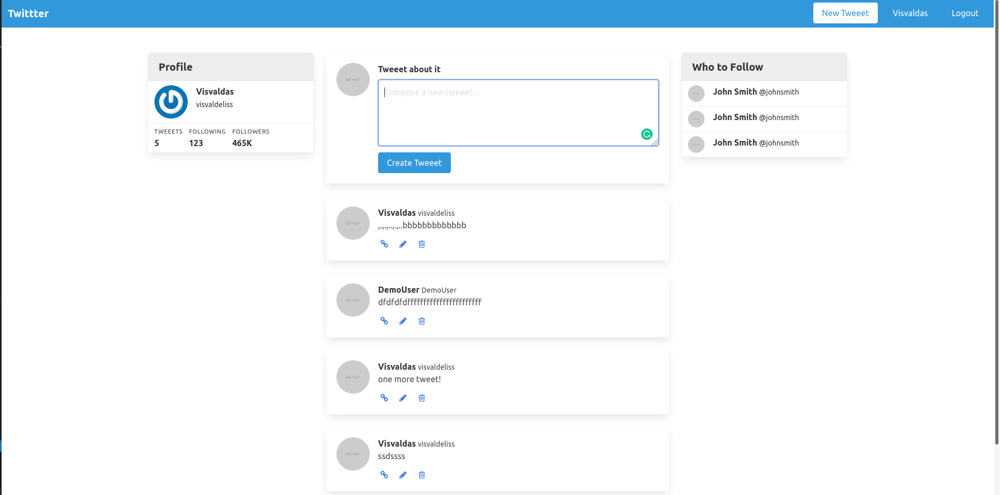

# Project-Authentication

This is the project to learn about building an application that allows users to create posts and the authors of the posts are displayed only if as a User you are logged in, in short - Authentication, it is done by following "Twitter clone" tutorial from: [@Web-Crunch](https://www.youtube.com/c/Webcrunch/featured) youtube channel.

 

## Built With

- Ruby
- Rubocop
- Ubuntu
- Rails

## Prerequisities

To get this project up and running locally, you must already have ruby and rails installed on your computer.

## Getting Started

**Setup**

- Clone this repository with `git clone git@github.com:visva-dev/Twitter-Clone.git` using your terminal or command line. 
- Change to the project directory by entering `cd Twitter-Clone` in the terminal 
- Next run `bundle install` to install the necessary dependencies 
- Run `rails db:migrate` to setup your local database. 
- Finally run `rails server` and open `http://localhost:3000/` in your browser to start the application. 

## Authors

👤 **Visvaldas Rapalis**

- Github: [@visva-dev](https://github.com/visva-dev)
- LinkedIn: [Visvaldas Rapalis](https://www.linkedin.com/in/visvaldas-rapalis/)
- Gmail: [visva.rapalis@gmail.com](mailto:visva.rapalis@gmail.com)

## 🤝 Contributing

Contributions, issues and feature requests are welcome!

## Show your support

Give a ⭐️ if you like this project!

## Acknowledgments

- This Project was part of an assignment available on The Odin Project.
- Our thanks to Microverse and all our peers and colleagues there.

## 📝 License

This project is [MIT](lic.url) licensed.
